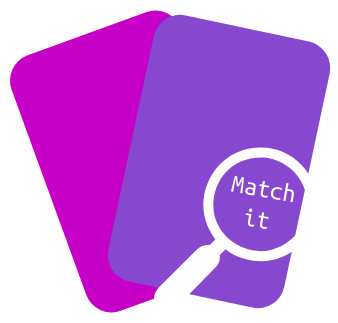
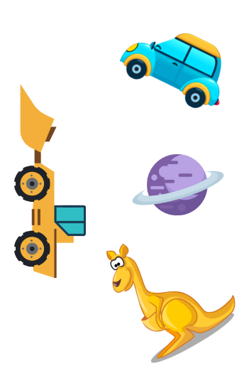
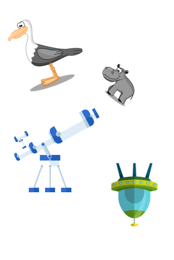

# Match it
Your own card game generator

Match It is a free to use (not for commercial purpose) card game generator. It can be played between two or more players in multiple ways. Players have to find one common image in two cards.

 

Randomly rotated, and resized images can introduce an extra level of complexity.

You can also design the game for a similar match instead of an exact match. For example, using the cards below, players need to match the images belonging to the same group.

 

Check [instructions]() to know multiple ways of playing the game. Feel free to submit new ways of playing by raising a PR or an issue.

## Design guide

This section may help to design good cards.

- Kids like colors so, avoid black & white text or images.
- Avoid gradient or shaded colors.
- You can increase complexity with rotated, similar color, similar looking, and different size images.
- Avoid rectangle images or images with border.
- Images with transparent background are good.                    

Check [resources]() which may help to collect beautiful images for your game.

[Credits](https://github.com/funcards/match-it/blob/master/credits.md)
