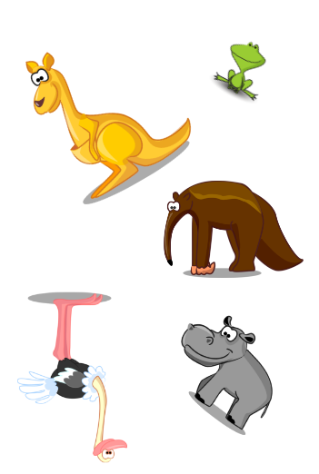

# Match it
Your own card game generator

Match it is free to use (not for commercial purpose) car game generator. It can be played between two or more players in multiple ways. Players have to find one common symbol in two cards.

 

Randomly rotated, and resized images can introduce extra level of complexity.

You can also design the game for similar match instead of exact match. Eg in below cards, players need to match the image belonging to the same group.

 

Check [instructions]() to know multiple ways of playing the card. Feel free to submit new ways of playing by raising the PR or an issue.

## Design guide

This section may helpful to design good games.

- Kids like colors. So avoid black & white text or images.
- Avoid gradient, or shaded colors.
- You can increase complexity with rotated, similar color, similar looking, and different size images.
- Avoid rectangle images or images with border.
- Images with transparent background are good.                    

Check [resources]() which may help to collect beautiful images for your game.